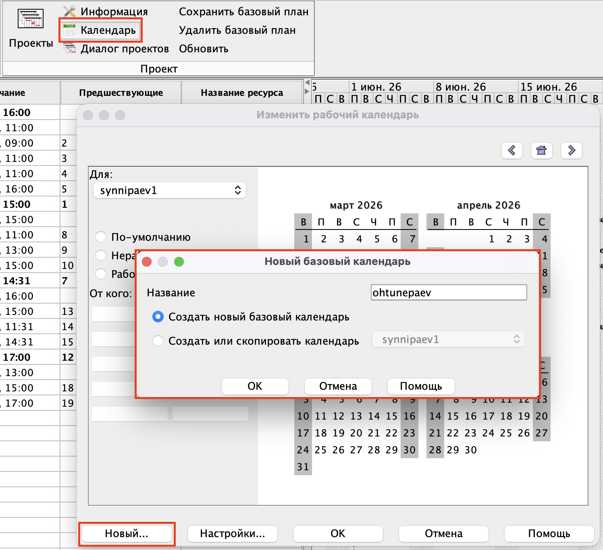
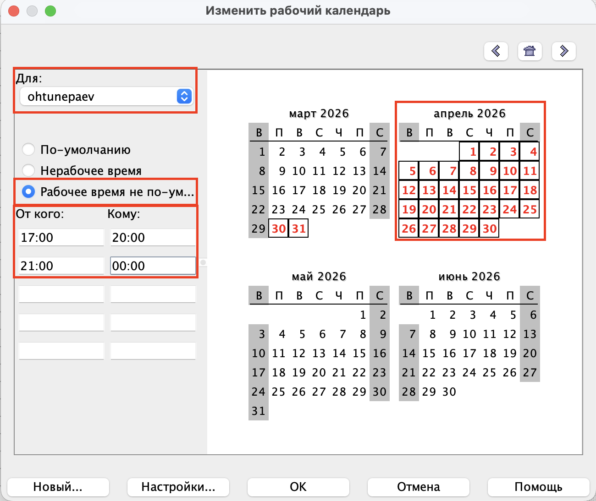
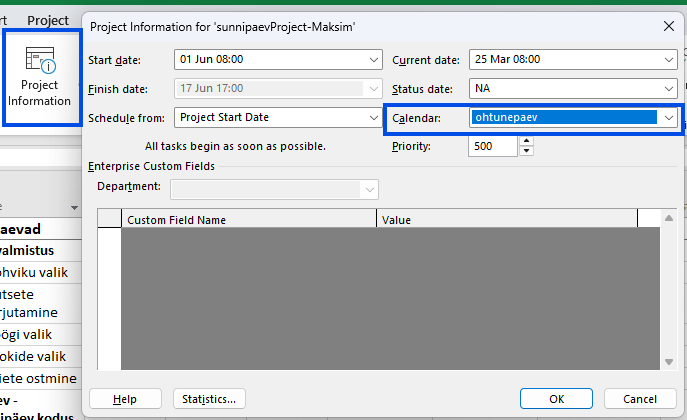
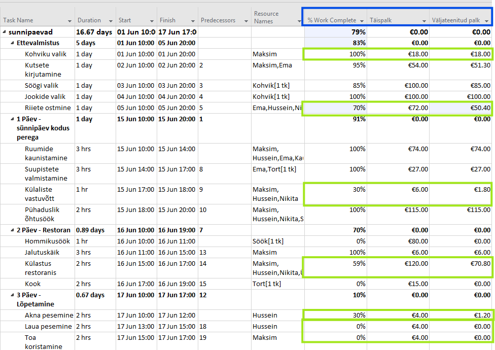
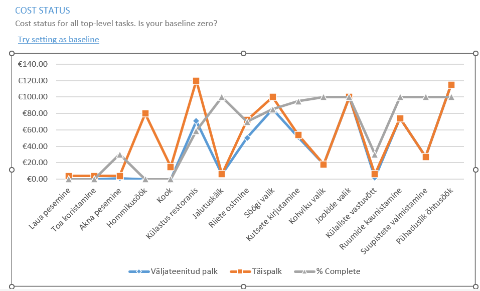

# MS Projecti juhend

## Sisukord

- [Projekti ülevaade](#projekti-ülevaade)
- [Mida hoidla sisaldab](#mida-hoidla-sisaldab)
- [Valminud dokumentatsiooni osad](#valminud-dokumentatsiooni-osad)
- [Valitud kuvatõmmised](#valitud-kuvatõmmised)
- [Dokumentatsiooni struktuur](#dokumentatsiooni-struktuur)
- [Kasulikud lingid](#kasulikud-lingid)

## Projekti ülevaade

See hoidla sisaldab **MS Projecti** kasutamist käsitlevat dokumentatsiooniprojekti. Tegemist on kompaktse õppematerjaliga, mis on üles ehitatud kolme praktilise teema ümber:

- kohandatud projektikalendri loomine ja kasutamine
- valemitega arvutusväljade lisamine
- aruannete diagrammide koostamine ja kohandamine

Põhidokumentatsioon on avaldatud struktureeritud MkDocsi veebilehena ning korraldatud lühikeste ja visuaalsete samm-sammuliste juhenditena.

## Mida hoidla sisaldab

- dokumentatsiooni sisu kaustas [docs/](docs/)
- projekti visuaale ja kuvatõmmiseid kaustas [docs/images/](docs/images/)
- saidi seadistust failis [mkdocs.yml](mkdocs.yml)
- Pythoni sõltuvuste kirjeldust failis [requirements.txt](requirements.txt)

## Valminud dokumentatsiooni osad

### 1. Kalendri loomine MS Projectis

Dokumenteeritud failis [docs/kalender.md](docs/kalender.md).

### 2. Arvutusväljad ja valemid

Dokumenteeritud failis [docs/arvutusvaljad.md](docs/arvutusvaljad.md).

### 3. Diagrammid ja aruanded

Dokumenteeritud failis [docs/diagramm.md](docs/diagramm.md).

## Valitud kuvatõmmised

Hoidlas on juba mitu kuvatõmmist, mis toetavad õppesisu ja juhendilehti.

### Kalendri töövoog

### Arvutusväljad ja tabeli tulemused

### Diagrammi näide

## Dokumentatsiooni struktuur

Praegune dokumentatsioonisait on üles ehitatud väikese, kuid selgelt fokusseeritud lehtede kogumina:

- [docs/index.md](docs/index.md) — avaleht, mis tutvustab õppeteemasid
- [docs/kalender.md](docs/kalender.md) — kalendri loomine, tööaja seadistamine ja projekti kalendri kasutamine
- [docs/arvutusvaljad.md](docs/arvutusvaljad.md) — kohandatud väljad, valemid ja arvutatud väärtused
- [docs/diagramm.md](docs/diagramm.md) — aruanded, filtreerimine ja diagrammipõhine analüüs

Nende lehtede navigeerimine on määratud failis [mkdocs.yml](mkdocs.yml)

## Kasulikud lingid

- [Material for MkDocs](https://squidfunk.github.io/mkdocs-material/) — dokumentatsioonisaidi generaator, millele projekt toetub
- [GitHub Pages](https://pages.github.com/) — avaldatud dokumentatsiooni majutusplatvorm
- [Avaldatud dokumentatsioonisait](https://maksimts-kool.github.io/TA-Kalender) — projekti dokumentatsiooni veebiversioon
