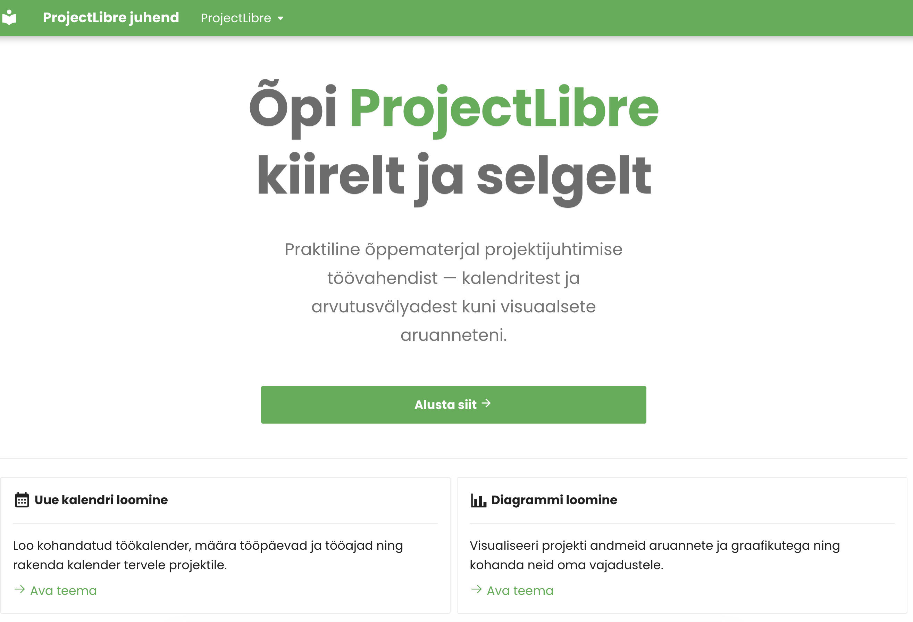
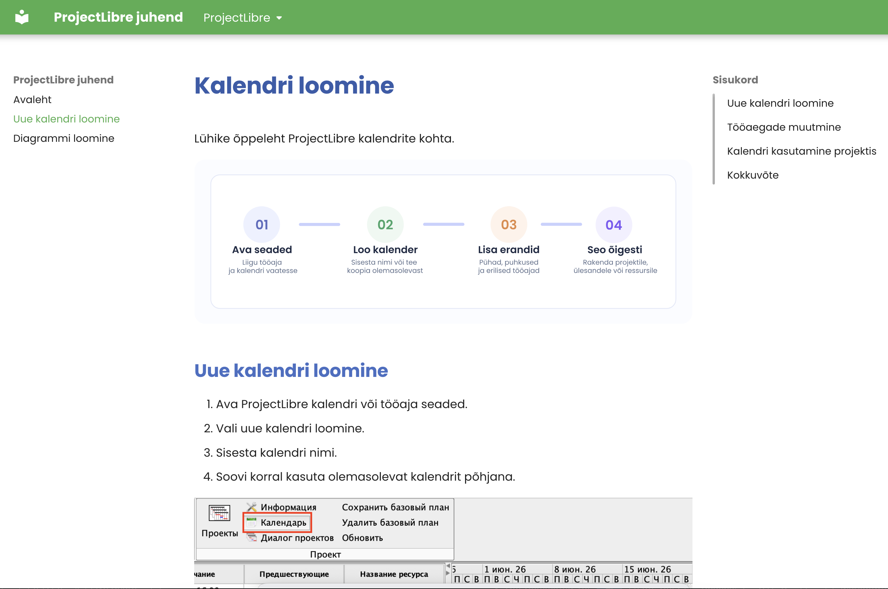

# ProjectLibre juhend

See hoidla sisaldab **ProjectLibre** kasutamise õppematerjali, mis on vormistatud MkDocsi dokumentatsioonisaidina. Fookus on praktilistel tegevustel: kohandatud kalendri loomisel, tööaja seadistamisel ning diagrammide kasutamisel projektiandmete mõistmiseks.[^mkdocs]

> [!NOTE]
> See haru ja dokumentatsioon on mõeldud **ProjectLibre** jaoks. Kui varasemates materjalides või commit'ides leidub viiteid MS Projectile, siis käesolev [`README.md`](README.md) kirjeldab ainult ProjectLibre-põhist sisu.

## Sisukord

- [Projekti ülevaade](#projekti-ülevaade)
- [Mida hoidla sisaldab](#mida-hoidla-sisaldab)
- [Valminud teemad](#valminud-teemad)
- [Tööde loend](#tööde-loend)
- [Valitud kuvatõmmised](#valitud-kuvatõmmised)
- [Dokumentatsiooni struktuur](#dokumentatsiooni-struktuur)
- [Kasulikud lingid](#kasulikud-lingid)
- [Joonealused märkused](#joonealused-märkused)

## Projekti ülevaade

Dokumentatsioon on koostatud lühikeste, visuaalsete ja samm-sammuliste juhenditena, et ProjectLibre põhifunktsioonid oleksid kiiresti õpitavad.

Peamised teemad:

- kohandatud projektikalendri loomine
- tööpäevade ja tööaegade muutmine
- projekti kalendri rakendamine
- diagrammivaadete avamine ja tõlgendamine

> [!TIP]
> Kõige kiirem alguspunkt on [`docs/kalender.md`](docs/kalender.md), sest see tutvustab konkreetset töövoogu koos piltidega.

## Mida hoidla sisaldab

- dokumentatsiooni sisu kaustas [`docs/`](docs/)
- kuvatõmmiseid ja illustratsioone kaustas [`docs/images/`](docs/images/)
- saidi navigeerimise ja teemaseaded failis [`mkdocs.yml`](mkdocs.yml)
- Pythoni sõltuvused failis [`requirements.txt`](requirements.txt)

## Valminud teemad

### 1. Kalendri loomine ProjectLibre'is

Dokumenteeritud failis [`docs/kalender.md`](docs/kalender.md).

Sisu hõlmab:

- uue kalendri loomist
- tööaegade kohandamist
- kalendri rakendamist projektis

### 2. Diagrammide kasutamine

Dokumenteeritud failis [`docs/diagramm.md`](docs/diagramm.md).

Sisu hõlmab:

- diagrammivaate avamist
- ressursi või andmetüübi valimist
- tulemuste tõlgendamist visuaalse graafiku kaudu

## Tööde loend

### Valmis osad

- [x] MkDocsi põhine dokumentatsioonistruktuur on seadistatud
- [x] Avaleht on loodud failis [`docs/index.md`](docs/index.md)
- [x] Kalendri juhend on koostatud failis [`docs/kalender.md`](docs/kalender.md)
- [x] Diagrammide juhend on koostatud failis [`docs/diagramm.md`](docs/diagramm.md)
- [x] Pildimaterjal on lisatud kausta [`docs/images/`](docs/images/)

### Järgmised võimalikud täiendused

- [ ] lisada rohkem teemasid ProjectLibre vaadete ja aruannete kohta
- [ ] täiendada juhendeid täiendavate näidete või vigade vältimise soovitustega
- [ ] lisada ühtne terminite loetelu algajatele kasutajatele
- [ ] avaldada ja kontrollida lõplik veebiversioon eri seadmetes

> [!IMPORTANT]
> Kui dokumentatsiooni laiendatakse, tasub hoida iga teema eraldi failis kausta [`docs/`](docs/), et navigeerimine failis [`mkdocs.yml`](mkdocs.yml) jääks lihtsaks.

## Saiti disain

Allolevad kuvatõmmised näitavad dokumentatsioonisaidi üldist visuaalset ülesehitust ja seda, kuidas õppesisu on kasutajale esitatud.[^screens]

### Avaleht

### Teema lehekülg

## Dokumentatsiooni struktuur

Praegune dokumentatsioonisait koosneb väikesest, kuid selgelt fokusseeritud lehtede kogumist:

- [`docs/index.md`](docs/index.md) — avaleht, mis tutvustab õppeteemasid
- [`docs/kalender.md`](docs/kalender.md) — kalendri loomine, tööaja seadistamine ja projekti kalendri kasutamine
- [`docs/diagramm.md`](docs/diagramm.md) — diagrammivaadete avamine, ressursiandmete vaatamine ja graafikute tõlgendamine

Navigeerimine ja saidi ülesehitus on määratud failis [`mkdocs.yml`](mkdocs.yml).

> [!WARNING]
> Mõned ProjectLibre vaated võivad sõltuda sellest, kas kasutaja töötab ülesannete või ressursside kontekstis. Seetõttu võivad kuvatavad diagrammid või valikud erineda näidispiltidest.

## Kasulikud lingid

- [Material for MkDocs](https://squidfunk.github.io/mkdocs-material/) — dokumentatsioonisaidi raamistik
- [GitHub Pages](https://pages.github.com/) — veebimajutuse lahendus staatilistele lehtedele
- [Avaldatud dokumentatsioonisait](https://maksimts-kool.github.io/TA-Kalender) — projekti veebiversioon

## Joonealused märkused

[^mkdocs]: Projekt kasutab MkDocsi ja Material for MkDocs teemat, et muuta õppesisu lihtsasti loetavaks ja veebis avaldatavaks.
[^screens]: Kuvatõmmised asuvad hoidlas lokaalselt, et dokumentatsioon oleks võimalikult iseseisev ja reprodutseeritav.
