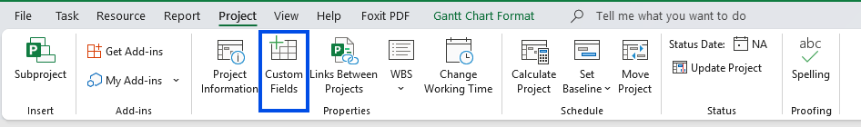
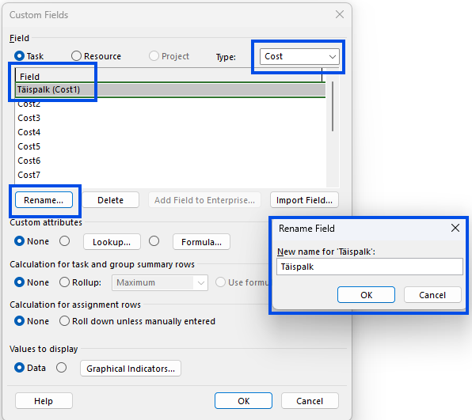
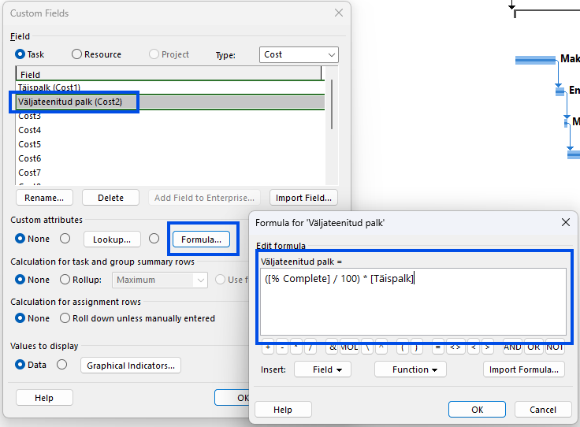

---
search:
  exclude: true
---

# <span style="font-weight: 800; color: #355caa;">Arvutusvälja lisamine</span>

Lühike õppeleht MS Projecti kohandatud arvutusväljade kohta.

## <span style="font-weight: 750; color: #466fc4;">Custom Fields avamine</span>

1. Ava MS Project ja liigu lindimenüüs vahekaardile **Project**.
2. Klõpsa nupule **Custom Fields**.



See aken võimaldab luua oma välju, ümber nimetada olemasolevaid kohandatud välju ning lisada neile valemeid.

## <span style="font-weight: 750; color: #466fc4;">Väljade nimetamine</span>

1. Veendu, et valitud oleks **Task**, kui soovid arvutust teha ülesande tasemel.
2. Vali sobiv väljatüüp, näiteks **Cost**, sõltuvalt sellest, mida soovid arvutada.
3. Vali loendist vaba kohandatud väli, näiteks **Cost1**.
4. Klõpsa **Rename**.
5. Pane väljale nimi, mis kirjeldab selle sisu, näiteks **Täispalk**.
6. Vali järgmine vaba väli, näiteks **Cost2**, ja nimeta see näiteks **Väljateenitud palk**.



Soovitatav on kasutada arusaadavaid nimesid, et tabelivaates oleks kohe näha, mida väli arvutab.

## <span style="font-weight: 750; color: #466fc4;">Valemi sisestamine</span>

1. Ava väli, kuhu soovid automaatse arvutuse lisada, näiteks **Väljateenitud palk**.
2. Klõpsa nupule **Formula**.
3. Sisesta valem, mis seob tehtud töö mahu täispalgaga.
4. Kinnita valem nupuga **OK**.

Näiteks kui soovid, et 100% tehtud töö korral kuvataks kogu palk ja väiksema edenemise korral vastav osa sellest, saad kasutada loogikat:

```text
([% Complete] / 100) * [Täispalk]
```



Selle valemi mõte on lihtne:

- kui ülesanne on tehtud **100%**, siis töötaja saab kätte **täispalga**;
- kui ülesanne on tehtud **50%**, siis arvutatakse välja **pool täispalgast**;
- kui edenemine on **0%**, siis on arvutatud väärtus samuti **0**.

See lähenemine sobib hästi olukorras, kus soovid siduda tasu reaalse töö edenemisega.

## <span style="font-weight: 750; color: #466fc4;">Tulemuse kuvamine tabelis</span>

1. Paremklõpsa tabeli päisel ja vali **Add New Column**.
2. Lisa vaatesse nii **Täispalk** kui ka **Väljateenitud palk**.
3. Vajadusel lisa ka **% Complete**, et arvutuse alus oleks kohe nähtav.
4. Kontrolli, et väärtused muutuksid koos ülesande edenemisega.


Kui veerud on tabelisse lisatud, näed ühe pilguga nii sisestatud algväärtust kui ka selle põhjal arvutatud tulemust.

## <span style="font-weight: 750; color: #466fc4;">Kokkuvõte</span>

Arvutusväljad aitavad MS Projectis siduda sisestatud andmed automaatsete tulemustega. Kui määrad ühe välja täispalga jaoks ja teise välja valemiga arvutatava tasu jaoks, saad kiiresti näha, kui suur osa palgast vastab tegelikult tehtud töö mahule.
