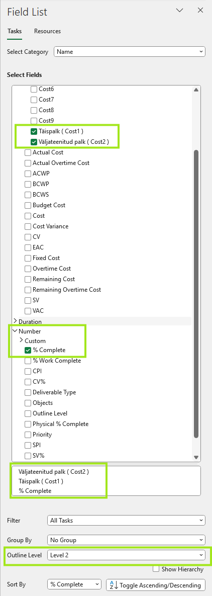

---
search:
  exclude: true
---

# Diagrammi loomine

Lühike õppeleht MS Projecti aruannete ja diagrammide loomisest.

## Aruanne tegemine

1. Ava MS Project ja liigu ülemisel lindimenüül vahekaardile **Report**.
2. Tutvu seal olevate aruandegruppidega, näiteks **Dashboards**.
3. Ava menüüst sobiv aruandegrupp, näiteks **Cost Overview**.

!!! note "Märkus"
    Vali kõigepealt vaade, mis sobib sinu projekti andmete visualiseerimiseks.
    
    Vajadusel ava mitu aruannet järjest, et võrrelda erinevaid vaatenurki.

Vahekaardilt **Report** saad kiiresti luua valmisdiagramme ilma, et peaksid kõiki elemente käsitsi joonistama.

## Andmete analüüsimine diagrammis

1. Ava valitud aruanne ja vaata, millised tabelid ning graafikud kuvatakse automaatselt.
2. Kontrolli, kas nähtavad andmed toetavad sinu eesmärki, näiteks kulud, lõpetamise protsent või ajakava seis.
3. Kasuta diagrammi, et märgata trende, kõrvalekaldeid või kriitilisi kohti projektis.
4. Võrdle vajadusel erinevaid aruandeid, et saada täpsem ülevaade.

Diagrammid aitavad andmeid kiiremini tõlgendada kui tavaline tabelivaade, sest olulisem info on visuaalselt kohe nähtav.

## Filtreerimine ja sisu kohandamine

1. Ava aruandes **Field List** või muu kohandamise paneel.
2. Vali, milliseid välju soovid diagrammil näidata.
3. Lisa või eemalda andmevälju vastavalt sellele, millist infot soovid rõhutada.
4. Kasuta filtreid, et kuvada näiteks ainult aktiivsed ülesanded või kindla kategooria andmed.

Sisu kohandamine aitab muuta aruande selgemaks ja projektile täpsemalt vastavaks.

## Kokkuvõte

Diagrammi loomine MS Projectis algab sobiva aruande avamisest, jätkub õige aruandetüübi valimisega ning lõpeb andmete kohandamise ja tõlgendamisega. Nii saad projekti seisu esitada arusaadavalt, visuaalselt ja kiiresti loetaval kujul.
