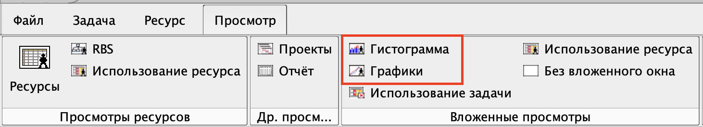
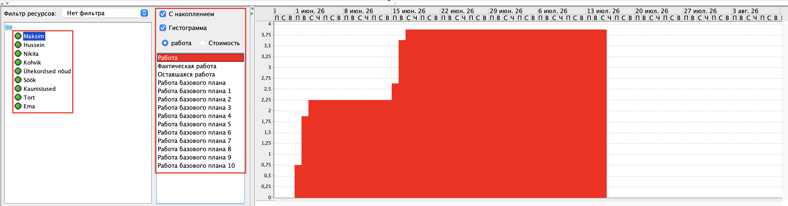

---
search:
  exclude: true
---

# Diagrammide kasutamine

Lühike õppeleht sellest, kuidas avada ja kasutada ProjectLibre diagrammivaateid.

## Diagrammivaate avamine

1. Ava ProjectLibre ja liigu ülemisel lindimenüül vahekaardile **View**.
2. Otsi vaadete hulgast diagrammidega seotud käsud **Bar chart** ja **Charts**.
3. Vajadusel ava enne ressursivaade, näiteks **Use of the resource**, et diagramm näitaks konkreetsete ressursside andmeid.

!!! note "Märkus"
    ProjectLibre'is ei looda diagrammi eraldi aruandena nagu mõnes teises projektihaldustarkvaras.
    
    Diagramm kuvatakse enamasti vaate osana ning selle sisu sõltub sellest, kas töötad ülesannete või ressurssidega.

## Ressursi valimine ja andmete kuvamine

1. Vali vasakpoolsest nimekirjast ressurss, kelle koormust või maksumust soovid vaadata.
2. Kontrolli ülemisi valikuid, näiteks **With accumulation** ja **Bar chart**, et määrata diagrammi kuvamisviis.
3. Vali, kas soovid näha töömahtu (**Work**) või kulusid (**Cost**).
4. Vaata paremal kuvatavat ajaskaalal diagrammi, mis näitab valitud ressursi koormuse muutumist ajas.

Diagramm aitab kiiresti märgata, millal ressursi töökoormus suureneb, püsib stabiilsena või võib muutuda liiga suureks.

## Kokkuvõte

ProjectLibre diagrammide kasutamine algab sobiva vaate avamisest, jätkub ressursi või andmetüübi valimisega ning lõpeb saadud graafiku tõlgendamisega. Nii saad projekti töökoormust ja ressursside kasutust hinnata kiiresti ning arusaadavalt.
