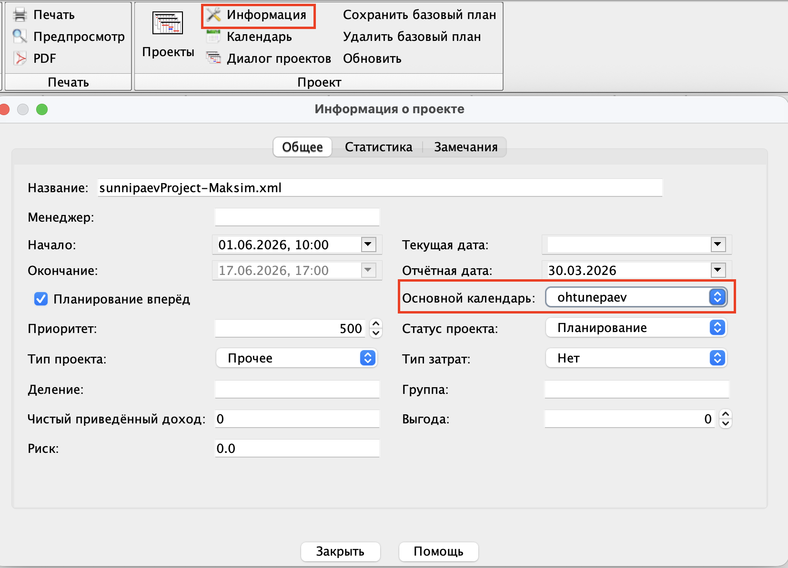

---
search:
  exclude: true
---

# Kalendri loomine MS Projectis

Lühike õppeleht MS Projecti kalendrite kohta.

## Uue kalendri loomine

1. Ava MS Projectis kalendri või tööaja seaded.
2. Vali uue kalendri loomine.
3. Sisesta kalendri nimi.
4. Soovi korral kasuta olemasolevat kalendrit põhjana.

Uut kalendrit kasutatakse siis, kui projekt vajab teistsugust töökorraldust kui vaikimisi kalender.

## Tööaegade muutmine

1. Ava loodud kalender.
2. Määra tööpäevad ja tööajad.
3. Lisa vajadusel erandid, näiteks pühad või puhkused.
4. Salvesta muudatused.

Tööaegu muudetakse selleks, et ajakava vastaks päris töökorraldusele.

## Kalendri kasutamine projektis

1. Ava projekti andmed või projekti info.
2. Leia kalendri valik.
3. Vali loodud kalender.
4. Kinnita muudatused.

Kalendrit saab kasutada kogu projekti jaoks või ainult kindlate ülesannete ja ressursside jaoks.

## Kokkuvõte

Kalendri loomine aitab määrata projekti töökorralduse, tööaegade muutmine täpsustab ajakava ja kalendri kasutamine projektis rakendab need seaded õigesse kohta.
