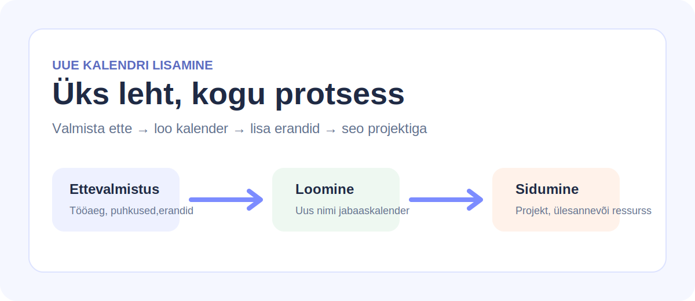

# Veebilehe loomine AI abil

## Ülevaade

AI abil genereeriti veebilehe põhifailid ja esialgne ülesehitus, mille peale sai kogu dokumentatsiooni rajada.

## Loodud põhiosad

### `index.html`

HTML-faili lisati:

- lehe pealkiri,
- sisuplokid,
- loogilised jaotused,
- navigeerimiseks vajalik struktuur.

See muutis info loetavaks ja sammudeks jaotatuks.

### `style.css`

CSS-fail määras:

- värvid,
- vahed,
- plokkide paigutuse,
- üldise visuaalse stiili.

Tänu sellele nägi dokumentatsioon puhas ja kaasaegne välja.

### Pealkiri, juhend ja pildid

Lehele lisati selge pealkiri, lühike juhend ning teemaga seotud illustratsioonid, mis aitavad teksti paremini mõista.

## Illustratsioonid

